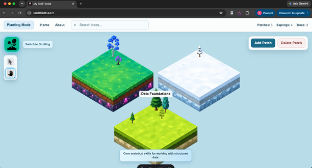
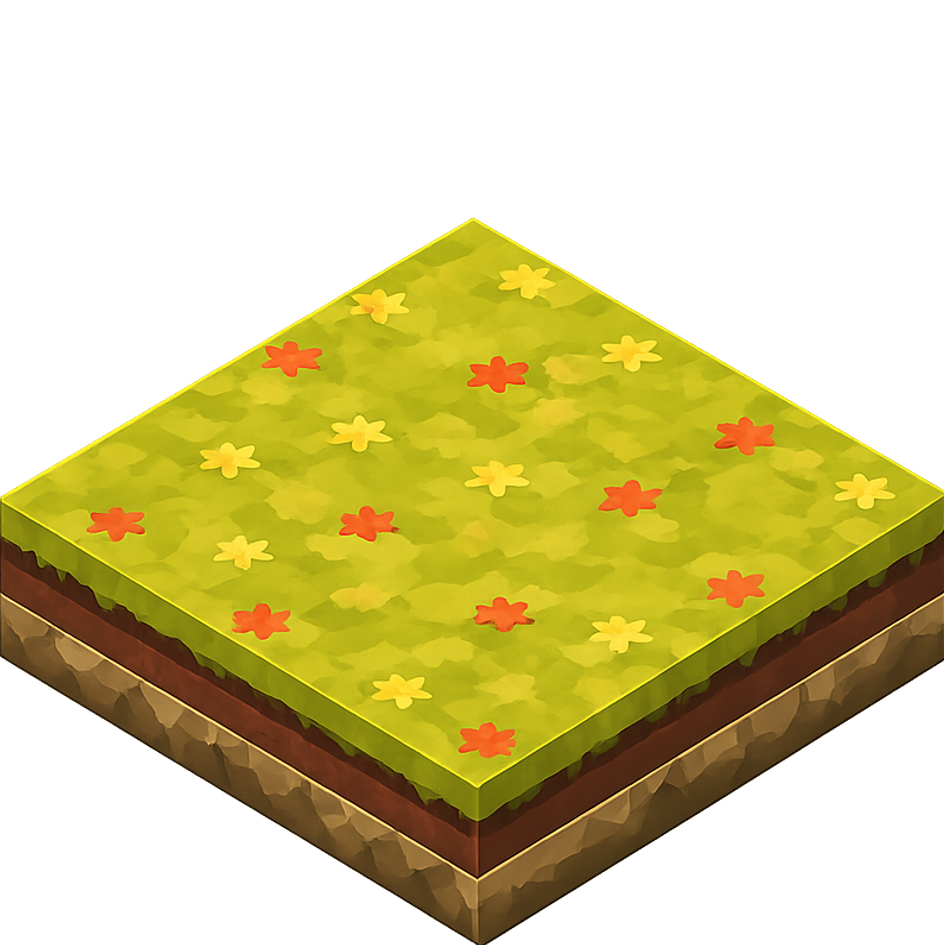
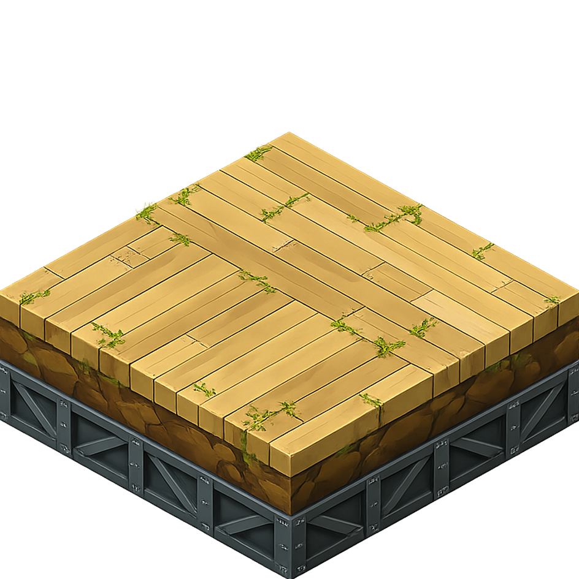

# The Skill Forest

<p align="center">
  
</p>

## About

**The Skill Forest** is a playful, interactive companion to a larger professional portfolio.

Instead of presenting every skill as another line in a list, the project imagines learning as a growing landscape. Broad areas of knowledge become **forest patches**, individual skills begin as **saplings**, and evidence of real work allows those saplings to mature into trees.

The forest is meant to evolve over time. As more skills are acquired, practiced, and demonstrated, the landscape becomes denser, more varied, and more alive. A sparse forest is not an unfinished portfolio—it is the starting point of a visible learning journey.

This repository is the reusable version of the project. It includes sample data, example evidence, editable terrain settings, and the local owner tools needed to create a personal forest.

---

## How to Use

The Skill Forest has two operating experiences:

- **Strolling Mode** for browsing and viewing
- **Planting Mode** for local owner editing

The public deployed site is intentionally read-only and opens in Strolling Mode. Planting operations are available only when the project is run locally.

### Taking a Stroll

Use Strolling Mode to explore the forest without changing its contents.

You can:

- Move around the forest using the Pan tool
- Hold `Shift` to temporarily activate panning
- Select a forest patch to open the Patch Inspector
- Select individual trees to view their name, planting date, sprouting date, description, and evidence
- Search for a tree using the search bar
- Use **Home** to recenter the forest and return to Strolling Mode
- Open **About** to learn more about the project

### Planting a Tree

Run the application locally:

```bash
npm run dev
```

Switch to **Planting Mode** to manage the forest.

You can:

- Add a new forest patch
- Edit a patch name, description, or terrain style
- Plant a new tree in the lowest available display slot
- Edit a tree's name, description, or planting date
- Add evidence manually to the tree's generated evidence folder
- Return to Strolling Mode at any time

Tree and patch records are stored in:

```text
storage/Forest_Patch.csv
storage/Trees.csv
```

Evidence is stored in:

```text
public/evidence/{Patch_ID}/{Tree_ID}/
```

### Deforestation

Planting Mode also includes destructive operations.

You can:

- **Chop a Tree** to remove one tree and its evidence folder
- **Delete Patch** to remove an entire forest patch, all trees assigned to it, and their evidence

Both actions require confirmation.

Deleting a patch preserves permanent patch IDs, then recalculates patch order and spiral coordinates so the remaining forest does not contain layout gaps.

---

## Assortment of Forest Patch Styles

Each forest patch uses one of nine terrain themes. The trees and saplings placed on that patch automatically use the matching art set.

<table>
  <tr>
    <td align="center"><br><strong>Classic Greens</strong></td>
    <td align="center"><br><strong>Autumn Walk</strong></td>
    <td align="center"><br><strong>Frosty Forest</strong></td>
  </tr>
  <tr>
    <td align="center"><br><strong>Fruit Foliage</strong></td>
    <td align="center"><br><strong>Mystical Tangle</strong></td>
    <td align="center"><br><strong>Wicked Woods</strong></td>
  </tr>
  <tr>
    <td align="center"><br><strong>Sakura Season</strong></td>
    <td align="center"><br><strong>Bamboo Thicket</strong></td>
    <td align="center"><br><strong>Industrial Zone</strong></td>
  </tr>
</table>

The available style names are configured in:

```text
src/data/styles.json
```

---

## How to Make a Tree Grow

A newly planted skill begins as a sapling.

To make it grow:

1. Run the project locally and plant a tree.
2. Locate its evidence folder:

   ```text
   public/evidence/{Patch_ID}/{Tree_ID}/
   ```

3. Add at least one meaningful evidence file.
4. Commit the evidence to Git.
5. Run the evidence synchronization script or build the project.

Accepted evidence can include:

- Project documentation
- Certificates
- Notebooks
- Reports
- Screenshots
- Markdown notes
- Links recorded in a Markdown file
- Other files that visibly support the claimed skill

Files such as `.gitkeep` and `.DS_Store` are ignored.

The synchronization rule is:

```text
No valid evidence
→ SAPLING
→ Date_Sprouted is blank

At least one valid evidence file
→ TREE
→ Date_Sprouted is derived from Git history
```

If all valid evidence is removed, the tree returns to sapling form.

Run synchronization manually with:

```bash
npm run sync:evidence
```

A production build also runs synchronization automatically.

---

## Demo Data

The repository includes demonstration data so the forest is populated immediately after installation.

The sample records are located in:

```text
storage/Forest_Patch.csv
storage/Trees.csv
public/evidence/
```

The demo forest includes:

- Multiple forest patch styles
- Both saplings and mature trees
- Sample evidence files
- Empty evidence folders preserved with `.gitkeep`

You can use the demo data to understand the workflow, then replace it with your own records.

For a fresh personal forest, clear the CSV rows while keeping their headers, then remove the demo evidence folders.

---

## Coordinate Testing Grounds

The repository includes a notebook for experimenting with tree placement and world layout:

```text
tools/Coordinate Testing Grounds.ipynb
```

Use it to inspect or revise the coordinates and settings used by:

```text
src/data/tree_slots.json
src/data/world_settings.json
```

The notebook is intended as a visual testing area before replacing the production configuration files.

---

## How to Install

### Requirements

- Node.js `22.12.0` or newer
- npm
- Git
- A local clone of the repository

### Installation

Clone or download the repository, then open a terminal in the project root.

```bash
npm install
```

Start the local owner version:

```bash
npm run dev
```

Open the local URL shown in the terminal, normally:

```text
http://localhost:4321
```

---

## Important Scripts

| Command | Purpose |
|---|---|
| `npm run dev` | Restores the local owner API and starts Astro development mode |
| `npm run prepare:owner` | Restores local editing API routes |
| `npm run prepare:public` | Removes local editing API routes before a static public build |
| `npm run sync:evidence` | Scans evidence folders and updates growth stages, sprouting dates, and patch counts |
| `npm run build` | Prepares public mode, synchronizes evidence, and creates the static production build |
| `npm run preview` | Previews the generated production build |
| `npm run check` | Runs Astro project checks |

Before publishing, test with:

```bash
npm run sync:evidence
npm run build
npm run preview
```

The production build is intended for **Strolling Mode only**. All planting and destructive operations remain local owner functions.

---

## Main Project Data

```text
storage/
├── Forest_Patch.csv
└── Trees.csv

public/
├── assets/
└── evidence/

src/data/
├── styles.json
├── tree_slots.json
└── world_settings.json
```

---

## Public Showcase and Personal Editing

The recommended setup is:

- Use this repository as the reusable template with demo data
- Create a separate personal copy for your own forest
- Edit your personal copy locally
- Commit and push your real records and evidence
- Deploy the personal copy as a public, read-only showcase

This keeps the downloadable starter project separate from the forest used in your broader professional portfolio.

---

## License

See [LICENSE](LICENSE).
